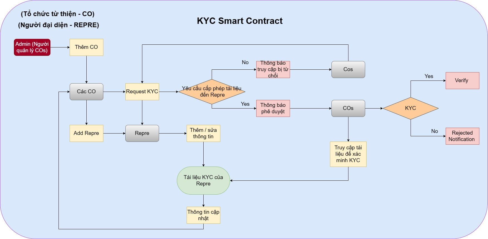

# Một vài đường links quan trọng

1. [Guide link](./GUIDE.md)<br />
2. [Contract Address](https://explorer.testnet.near.org/transactions/7MuWWhaYirpxqMJ19Gi2Vc6d2a17BWX3rGoUNhPp2gem)<br/>
3. [Contract Creator](https://explorer.testnet.near.org/transactions/hbs5coB1KmS1FMn9AvUr2eaZnycXfYE7nWmo6rucTYr)<br/>
4. [Tx Hash of contract creation](https://explorer.testnet.near.org/blocks/HRQ78yrmw5cPiWAX6XV4xgssjUap6B8KFM2yQdT5xBg7)<br/>

# Decentralised KYC Near

KYC là một quá trình mà các doang nghiệp/tổ chức có được thông tin về danh tính và địa chỉ của đối tác/khách hàng. Đó là quy trình do cơ quan quản lý điều hành nhằm thực hiện thẩm định để xác minh danh tính của đối tác/khách hàng. Quá trình này giúp đảm bảo rằng các dịch vụ của doang nghiệp/tổ chức không bị lạm dụng. Các doang nghiệp/tổ chức có trách nhiệm hoàn thành thủ tục KYC khi mở tài khoản. Các doang nghiệp/tổ chức cũng được yêu cầu cập nhật định kỳ chi tiết KYC của đối tác/khách hàng. KYC có thể là thủ công, tốn thời gian và dư thừa giữa các tổ chức. Chia sẻ thông tin KYC trên Blockchain sẽ cho phép các tổ chức tài chính mang lại kết quả tuân thủ tốt hơn, tăng hiệu quả và cải thiện trải nghiệm của đối tác/khách hàng.

## Vấn đề

Mỗi doang nghiệp/tổ chức phải xác minh danh tính của bạn bằng cách nào đó và điều này đặc biệt quan trọng đối với tổ chức cần sự minh bạch. Từ đó, các giao thức 'Know Your Customer' (hay KYC) đã phát triển để hỗ trợ các doang nghiệp/tổ chức đảm bảo họ biết họ đang làm việc với ai. Thông thường, điều này liên quan đến một số phương pháp mở rộng, trong đó có một số tài liệu nhất định được hiển thị và một số loại kiểm tra hoặc xác minh lý lịch diễn ra. Trong hệ thống KYC truyền thống, mỗi doang nghiệp hoặc tổ chức sẽ tiến hành kiểm tra danh tính riêng của mình, tức là mỗi người dùng được kiểm tra riêng lẻ bởi một tổ chức cá nhân hoặc cơ cấu chính phủ. Do đó, sẽ lãng phí thời gian để kiểm tra từng danh tính từ đầu.

## Giải pháp

Kiến trúc chuỗi khối và sổ cái phân tán (Distributed Ledger Technology - DLT) cho phép nhóm thu thập thông tin từ các nhà cung cấp dịch vụ hay các tổ chức khác nhau vào một cơ sở dữ liệu không thay đổi và bảo mật bằng mật mã mà không cần bên thứ ba xác minh tính xác thực của kiến thức. Có thể hình thành một hệ thống mà người dùng chỉ cần thực hiện quy trình KYC một lần để xác minh danh tính của mình.

## Required:

- Các vai trò khác nhau: Tổ chức quản lý từ thiện (ví dụ: RBI), Tổ chức từ thiện & Người đại diện.
- Smart contract bao gồm tất cả các quy tắc và giao thức cần thiết cho luồng tài liệu KYC. Nhóm đã tạo 2 địa chỉ liên hệ cho Tổ chức quản lý và Người đại diện, đồng thời kế thừa hợp đồng KYC của hợp đồng đó.
- Mạng Blockchain để triển khai Hợp đồng. Nhóm đã sử dụng Near Testnet cho hợp đồng của này.

## Các giả định:

<b>1. Admin của tổ chức quản lý có thể thêm CO (Tổ chức từ thiện - Charity Organizations) đã được xác minh:</b>

    Người quản trị của tổ chức quản lý có thể thêm các tổ chức từ thiện khác đã được xác minh vào hệ thống.

<b>2. Admin có thể làm cho CO trở nên hoạt động/không hoạt động liên quan đến bất kỳ hành động nào:</b>

    Người quản trị có quyền làm cho các tổ chức từ thiện trở thành hoạt động hoặc không hoạt động liên quan đến các chức năng và hoạt động trong hệ thống.

<b>3. CO có thể thêm Repre (Người đại diện) và yêu cầu KYC từ Repre:</b>

    Các tổ chức từ thiện có thể thêm người đại diện vào hệ thống và yêu cầu người đại diện cung cấp thông tin KYC.

<b>4. Repre có thể phê duyệt/từ chối yêu cầu KYC từ CO:</b>

    Người đại diện có quyền phê duyệt hoặc từ chối yêu cầu cung cấp thông tin KYC từ tổ chức từ thiện.

<b>5. Nếu Repre chấp thuận yêu cầu KYC, một thông báo (qua email/số điện thoại) sẽ được gửi đến CO và CO có thể truy cập các tài liệu KYC của người đại diện như Thẻ Aadhar, Pancard, ID ảnh, Chữ ký, v.v. để xác minh:</b>

    Nếu người đại diện đồng ý cung cấp thông tin KYC, một thông báo sẽ được gửi đến tổ chức từ thiện, thông qua email hoặc số điện thoại, và tổ chức từ thiện có quyền truy cập các tài liệu KYC của người đại diện như Chứng minh nhân dân Aadhar, Chứng minh thuế PAN, Giấy tờ tùy thân, Chữ ký, v.v. để tiến hành xác minh.

<b>6. CO có thể phê duyệt/từ chối dữ liệu của Repre sau khi xác minh:</b>

    Nếu tổ chức từ thiện từ chối xác minh KYC của người đại diện, một thông báo sẽ được gửi đến người đại diện qua email hoặc số điện thoại, kèm theo lý do từ chối.

<b>7. Nếu CO từ chối xác minh KYC của Repre, một thông báo (qua email/số điện thoại) sẽ được gửi cho Repre kèm theo lý do:</b>

    Nếu tổ chức từ thiện từ chối xác minh KYC của người đại diện, một thông báo sẽ được gửi đến người đại diện qua email hoặc số điện thoại, kèm theo lý do từ chối.

<b>8. Người đại diện có thể cập nhật các tài liệu KYC và thông báo cập nhật sẽ được kích hoạt cho tất cả các CO được kết nối:</b>

    Nếu người đại diện từ chối xác minh KYC của người đại diện, một thông báo sẽ được gửi đến người đại diện qua email hoặc số điện thoại, kèm theo lý do từ chối.

<b>9. Tất cả các vai trò người dùng phải có địa chỉ ví near bắt buộc trên mạng triển khai.</b>

<b>10. Người dùng triển khai hợp đồng lên mạng chính sẽ được coi là Quản trị viên CO:</b>

    Người dùng triển khai hợp đồng thông minh (smart contract) lên mạng chính sẽ được xem là quản trị viên của tổ chức từ thiện.

## Sơ đồ hoạt động

<p align="center">
  
</p>

# Cùng bắt đầu với KYC Smart Contracts

[Thiết lập nền tảng! ](../SETUP.md)

## Rust

### Hàm kiểm tra điều kiện tiên quyết

```rust
    // Kiểm tra có chính xác là super Admin không
    pub fn is_admin(&self){
        assert_eq!(env::predecessor_account_id(), self.admin.clone(), "Only admin is allowed");
    }

    //Kiểm tra có chính xác là một COs hợp lệ khôg
    pub fn is_valid_co(&self, id_: AccountId) {
        assert_ne!(id_, AccountId::new_unchecked("".to_string()), "CO not found");
        let co = self.cos.get(&id_).expect("CO not found");
        assert_eq!(co.id_, id_, "CO not found");
        assert_eq!(co.status, COStatus::Active, "CO is not active");
    }

    //Kiểm tra có phải là một Người đại diện hợp lệ không
    pub fn is_valid_repre(&self, id_: AccountId) {
        assert_ne!(id_, env::current_account_id(), "Id is Empty");
        assert!(self.repres.contains_key(&id_), "User Id Empty");
        assert!(!self.repres.get(&id_).unwrap().email.is_empty(), "User Email Empty");
    }
```

### KYC Objects

```rust
    pub enum Role {
        Admin, // 0
        Co, // 1
        Repre, // 2
    }

    pub enum CoStatus {
        Active, // 0
        Inactive, // 1
    }

    pub enum KycStatus {
        Pending, // 0
        KYCVerified, // 1
        KYCFailed, // 2
    }

    pub enum DataHashStatus {
        Pending, // 0
        Approved, // 1
        Rejected, // 2
    }

    pub struct User {
        pub name: String,
        pub email: String,
        pub id_: AccountId,
        pub role: Role,
        pub status: CoStatus,
    }

    pub struct Repre {
        pub name: String,
        pub email: String,
        pub mobile_number: u32,
        pub id_: AccountId,
        pub kyc_verified_by: AccountId, 
        pub data_hash: String, 
        pub data_updated_on: u32,
    }

    pub struct Co {
        pub name: String,
        pub email: String,
        pub id_: AccountId,
        pub npoid_code: String,
        pub kyc_count: u16, 
        pub status: CoStatus, 
    }

    pub struct KycRequest {
        pub id_: String, 
        pub user_id_: AccountId,
        pub repre_name: String,
        pub co_id_: AccountId,
        pub co_name: String,
        pub data_hash: String,
        pub updated_on: u32,
        pub status: KycStatus,
        pub data_request: DataHashStatus, 
        pub additional_notes: String, 
    }
```

### Các phương thức chung

| **Function Name**    | **Input Params**                   | **Return value** | **Description**                                                                                     |
| -------------------- | ---------------------------------- | ---------------- | --------------------------------------------------------------------------------------------------- |
| who_am_i()             | -                                  | User             | Để lấy thông tin chi tiết của người dùng đã đăng nhập (Để quyết định xem tôi là tổ chức từ thiện hay quản trị viên hay user bình thường) |
| get_repre_details_kyc() | Địa chỉ ví của khách hàng | Repre         | Lấy thông tin của Repre                                                                          |
| get_co_details()     | Địa chỉ ví của COs     | Bank             | Lấy thông tin của một CO                                                                     |

### Admin Interface Methods

| **Function Name**        | **Input Params**                                     | **Return value**              | **Description**                                             |
| ------------------------ | ---------------------------------------------------- | ----------------------------- | ----------------------------------------------------------- |
| get_all_cos()            | page_number                                           | `total_pages` count,<br>Co[] | Để có được tất cả danh sách các CO đã được thêm bởi super Admin |
| add_co()                | Co                                                 | -                             | Thêm một CO mới                                             |
| update_co_details()      |  `Địa chỉ` ví near của CO,<br>email,<br>tên        | -                             | Cập nhật tên và email cho CO                      |
| activate_deactivate_co() | `Địa chỉ` ví near của CO,<br>`is_activated` boolean | -                             | Để tắt và mở trạng thái hoạt động của CO               |

### CO Interface Methods

| **Function Name**        | **Input Params**                                                             | **Return value**                                                 | **Description**                                                                                                     |
| ------------------------ | ---------------------------------------------------------------------------- | ---------------------------------------------------------------- | ------------------------------------------------------------------------------------------------------------------- |
| get_repres_of_co()     | page_number                                                                   | `total_pages` count,<br>KycRequest[]                              | Để có được tất cả danh sách các yêu cầu kyc của Repre đã được thêm bởi CO hiện tại                                    |
| add_kyc_request()          | Repre,<br>current `time` in epoch,<br>additional `notes`                  | -                                                                | Để thêm yêu cầu KYC mới bằng cách thêm Repre mới                                                                       |
| re_request_for_kyc_request() | `Địa chỉ` ví near của Repre,<br>additional `notes`                    | -                                                                | Nếu CO từ chối xác minh KYC hoặc Nếu Repre từ chối vấn đề cấp phép thì yêu cầu này có thể được thực hiện lại |
| update_kyc_verification()  | `Địa chỉ` ví near của Repre,<br>`verified` boolean,<br>additional `notes` | -                                                                | Để đánh dấu một Repre là đã xác minh KYC                                                                                  |
| search_repres()        | `Địa chỉ` ví near của Repre                                               | `bool` to say repre exists or not,<br>Repre,<br>KycRequest | To fetch repre by near address                                                                               |

### Repre Interface Methods

| **Function Name**           | **Input Params**                                                            | **Return value**                                         | **Description**                                                                           |
| --------------------------- | --------------------------------------------------------------------------- | -------------------------------------------------------- | ----------------------------------------------------------------------------------------- |
| get_co_requests()           | page_number                                                                  | `total_pages` count,<br>KycRequest[]                      | Để có được tất cả danh sách các CO đã yêu cầu KYC & được liên kết với Repre hiện tại |
| action_on_kyc_request()        | `Địa chỉ` ví near của CO,<br>boolean `bank_id_`,<br>additional `notes` | -                                                        | Để cập nhật yêu cầu KYC (Chấp thuận hoặc Từ chối)                                    |
| update_profile()             | name,<br>email,<br>mobile number                                            | -                                                        | Để cập nhật các chi tiết hồ sơ như tên, email, số điện thoại di động                             |
| update_datahash()            | hash,<br>current `time` in epoch                                            | -                                                        | Để cập nhật Data hash của tài liệu                                                  |
| remove_datahash_permission() | `Địa chỉ` ví near của CO,<br>additional `notes`                           | -                                                        | Để xóa quyền đọc tài liệu đối với một CO cụ thể                                    |
| search_cos()               | `Địa chỉ` ví near của CO                                                  | `bool` to say CO exists or not,<br>CO,<br>KycRequest | Để có được một chi tiết CO cụ thể thông qua tìm kiếm địa chỉ                                         |

### Events

| **Event Name**            | **Params**                                                                                                                              | **Description**                                                             |
| ------------------------- | --------------------------------------------------------------------------------------------------------------------------------------- | --------------------------------------------------------------------------- |
| add_co                 | `Địa chỉ` ví near,<br>name,<br>email,<br>npoid_code                                                                                     | Được kích hoạt khi một CO mới được thêm bởi Super Admin (RBI)                           |
| update_co               | `Địa chỉ` ví near,<br>name,<br>email                                                                                                   | Được kích hoạt khi CO cập nhật thông tin chi tiết                                    |
| activate_deactivate_co             | `Địa chỉ` ví near,<br>name                                                                                                             | Được kích hoạt khi Super Admin activate hoặc deactivate                                         |
|                           |                                                                                                                                         |                                                                             |
| add_repre             | `Địa chỉ` ví near,<br>name,<br>email                                                                                                   | Kích hoạt khi CO thêm Repre mới                                       |
| update_profile       | `Địa chỉ` ví near,<br>name,<br>email                                                                                                   | Kích hoạt khi Repre cập nhật thông tin                             |
| update_data_hash           | `Địa chỉ` ví near,<br>name,<br>datahash                                                                                                | KÍch hoạt khi Repre cập nhật KYC documents của mình                       |
| remove_datahash_permission | Request ID,<br>CO Name,<br>Repre Name,<br>`Địa chỉ` ví near Repre,<br>`Địa chỉ` ví near CO,<br>Datahash permission `status` | Được kích hoạt khi Repre thu hồi/cấp quyền cho tài liệu KYC của mình. |
|                           |                                                                                                                                         |                                                                             |
| add_kyc_request           | Request ID,<br>CO Name,<br>Repre Name                                                                                              | KÍch hoạt khi CO thêm một yêu cầu KYC mới                                   |
| re_request_for_kyc_request            | Request ID,<br>CO Name,<br>Repre Name                                                                                              | Được kích hoạt khi CO yêu cầu lại quyền tài liệu KYC.               |
| update_kyc_verification          | Request ID,<br>CO Name,<br>Repre Name,<br>`Địa chỉ` ví near Repre,<br>`Địa chỉ` ví near CO,<br>KYC verification `status`    | Được kích hoạt khi CO từ chối/xác minh tài liệu KYC                          |

### Versions

Cargo: cargo 1.69.0 (6e9a83356 2023-04-12)

Compiler: rustc: 1.69.0 (84c898d65 2023-04-16)

Near-sdk: v4.1.1

Node: v16.17.1

### Quickstart

Clone this repository locally or [**open it in gitpod**](https://github.com/DevPhamPham/CharityChain-CRT-). Then follow these steps:

1. Install Dependencies
```bash
npm install
```

2. Test the Contract
Deploy your contract in a sandbox and simulate interactions from users.

```bash
npm test
```

3. Deploy the Contract
Build the contract and deploy it in a testnet account
```bash
npm run deploy
```

4. Start the Frontend
Start the web application to interact with your smart contract 
```bash
npm start
```

## Team ✨

Thành viên trong nhóm

<table>
  <tr>
    <td align="center"><a href="https://www.linkedin.com/in/ph%E1%BA%A1m-khoa-230741232/"><br /><sub><b>Phạm Duy Khoa</b></sub></a><br /><a href="https://github.com/DevPhamPham" title="Code">💻</a> <a href="https://github.com/DevPhamPham" title="Documentation">📖</a> <a href="https://github.com/DevPhamPham/" title="Maintenance">❌</a></td>
    <td align="center"><a href="https://www.facebook.com/nguyenthianhthu09"><br /><sub><b>Nguyễn Thị Anh Thư</b></sub></a><br /><a href="https://github.com/nguyenthianhthu0903" title="Code">💻</a> <a href="https://github.com/nguyenthianhthu0903" title="Documentation">📖</a> <a href="https://github.com/nguyenthianhthu0903" title="Maintenance">✅</a></td>
  </tr>
  </table>

---

# How frontend works

## Coming soon